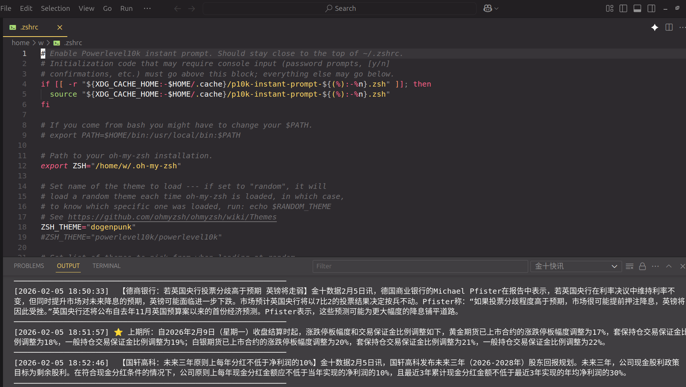

# 金十数据快讯 VSCode 插件

自动抓取金十财经快讯并显示在 VSCode 的 Output 面板中。

## 功能

- 🔄 **自动抓取**: 定时从金十数据获取最新财经快讯
- 📺 **Output 输出**: 格式化显示在 VSCode 输出面板
- ⭐ **重要标记**: 重要新闻以星标高亮显示
- ⚙️ **可配置**: 自定义刷新间隔和过滤选项

## 效果展示



## 使用方法

### 命令

按 `Ctrl+Shift+P` (Mac: `Cmd+Shift+P`) 打开命令面板，输入:

- `Jin10: 开始抓取快讯` - 启动快讯抓取
- `Jin10: 停止抓取快讯` - 停止抓取
- `Jin10: 立即刷新` - 手动刷新获取最新快讯

### 配置选项

在设置中搜索 `jin10-news`:

| 设置 | 默认值 | 描述 |
|------|--------|------|
| `jin10-news.refreshInterval` | 30 | 刷新间隔（秒） |
| `jin10-news.showImportantOnly` | false | 仅显示重要新闻 |

## 开发

### 安装依赖

```bash
cd jin10-news
npm install
```

### 编译

```bash
npm run compile
```

### 调试

按 F5 启动 Extension Development Host 进行调试。

## 许可证

MIT
